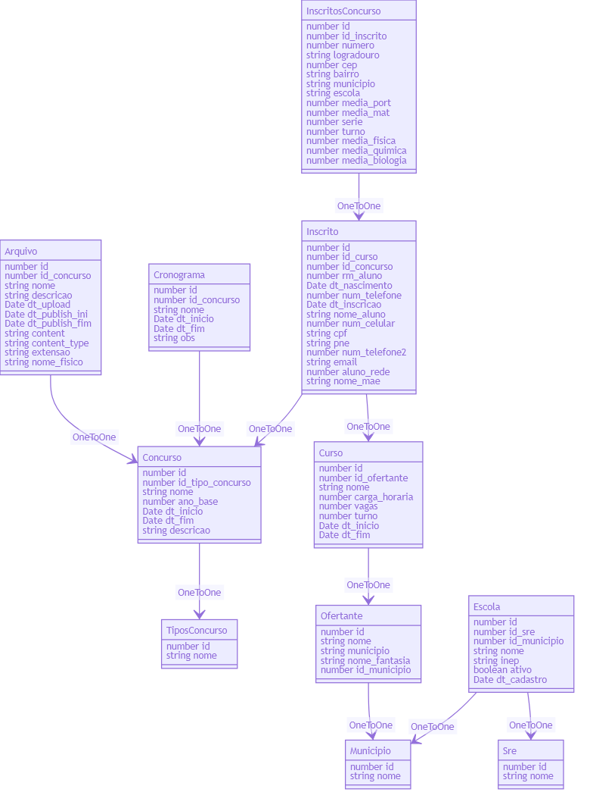
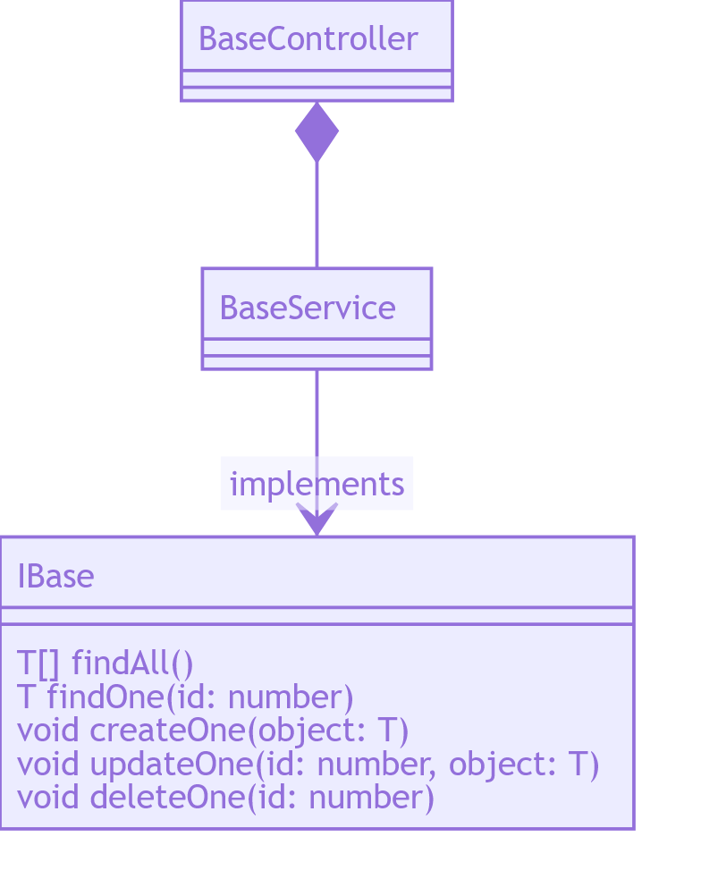

###Entidades

Entidade  | Descricao
:-------------: | :-------------:
Arquivo | Preencha este campo
Concurso | Preencha este campo
Cronograma | Preencha este campo
Curso | Preencha este campo
Escola | Preencha este campo
Inscrito | Preencha este campo
InscritosConcurso | Preencha este campo
Municipio | Preencha este campo
MunicipiosAbrangentes | Preencha este campo
Ofertante | Preencha este campo
Series | Preencha este campo
Sre | Preencha este campo
TiposConcurso | Preencha este campo

###DTOs

Entidade  | Descricao
:-------------: | :-------------:
Outro | Preencha este campo
Anexo | Preencha este campo

###Diagrama de classe

###Arquitetura generica

